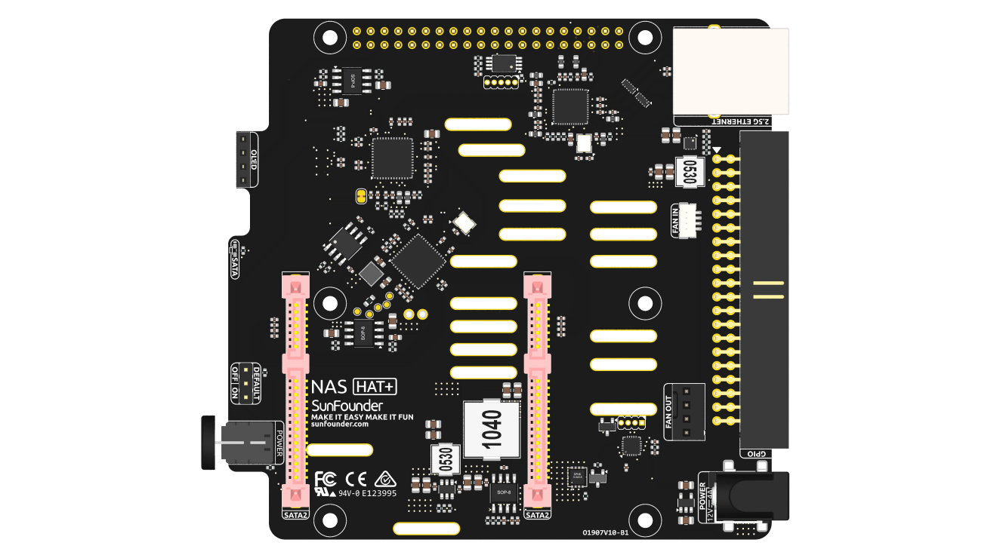
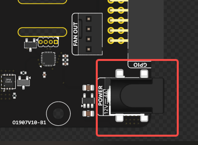
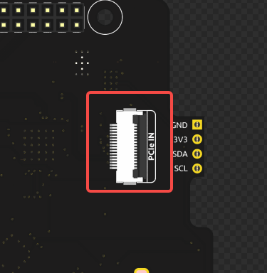
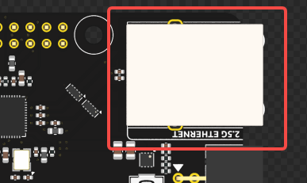
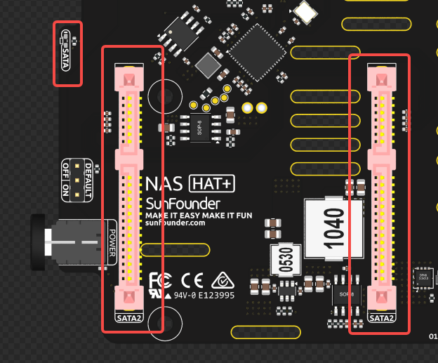
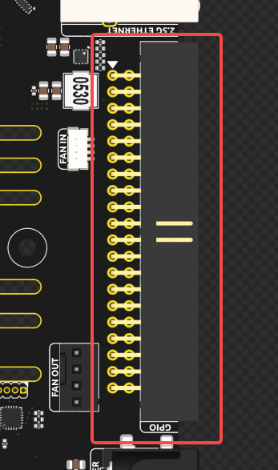
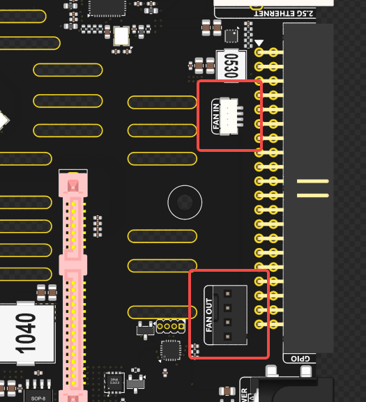
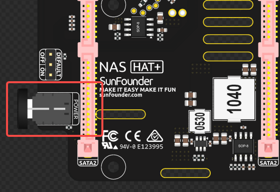
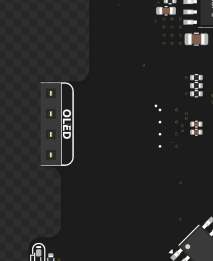

NAS Expansion Board
=========================

.. .. image:: img/nas_b_backward.png

**Power Input**

The board uses a DC 5.5-2.1 input connector, with an input voltage requirement of 12V/4A.  
The power input supplies power directly to the hard drives, so the voltage must be 12V ±10%.

**PCIe Input and PCIe Switch**

The PCIe connector is located on the back of the board and uses a standard Raspberry Pi PCIe FFC interface to connect to the Raspberry Pi 5.  
The PCIe interface is split into two PCIe Gen2 lanes via an onboard ASM1182e PCIe switch, which connects to the 2.5G Ethernet controller and the SATA controller.  
Note: ASM1182e supports PCIe Gen2 input/output only and does not support Gen3.

**2.5G Ethernet Controller**

The board integrates a PCIe to 2.5G Ethernet controller, routed through the PCIe switch.  
This interface can be used in parallel with the onboard 1Gb Ethernet port on the Raspberry Pi.  
The Ethernet controller uses the RTL8125 chip, compatible with the ``r8169`` driver.  
Most Linux kernels include this driver by default, so no additional installation is typically required.

**Dual SATA Ports**

The board uses an ASM1061 PCIe to dual SATA controller, allowing connection of 3.5" or 2.5" SATA hard drives.  
RAID0/RAID1 can be configured via the ``mdadm`` software tool.  
A single SATA LED indicates disk activity; it will blink when either drive is accessed.

**Raspberry Pi GPIO Header**

The board replicates the full Raspberry Pi GPIO header.  
Except for the I2C interface (used for the OLED display) and the ID SC/ID SD pins (connected to the onboard EEPROM), all GPIO pins are fully available.  
Since I2C allows multiple devices on the same bus, these pins are also accessible externally.

**Fan Interface**

The fan header adapts the Raspberry Pi’s 5V SH1.0 fan interface to a standard 12V PC case fan connector.  
The ``FAN IN`` port connects to the Raspberry Pi, while the ``FAN OUT`` port connects to the external fan.  

**Power Button and Power Control**

The power button includes an integrated power indicator LED.  
The button connects to an onboard microcontroller that manages the power switch logic:

- Short press: Power on  
- Long press (2 seconds): Graceful shutdown (simulates pressing the Pi's power button)  
- Hold for 5 seconds: Immediate power cut-off

**Shutdown Behavior**:

When a 2-second long press is detected, the microcontroller simulates a power button press on the Raspberry Pi via pogo pins.  
It then monitors the 3.3V line to confirm system shutdown.  
To enable this, make sure the Raspberry Pi EEPROM is configured with ``POWER_OFF_ON_HALT=1``.  
Once 3.3V drops, the microcontroller will cut off the main system power.  

Even when the system is off, the microcontroller remains powered (~60mW consumption).  

**OLED Wake Feature**: After powering on, a short press on the power button can wake the OLED from sleep mode.

**OLED Interface**

A 4-pin 2.54mm header is provided for an OLED module over the I2C bus.  
The board is designed to be compatible with a dedicated OLED display that can be directly mounted.

**Default ON/OFF Jumper**

Default power behavior can be configured via a jumper:

- Jumper on **ON** side: Auto power-on when power is applied  
- Jumper on **OFF** side: Requires pressing the power button to turn on

