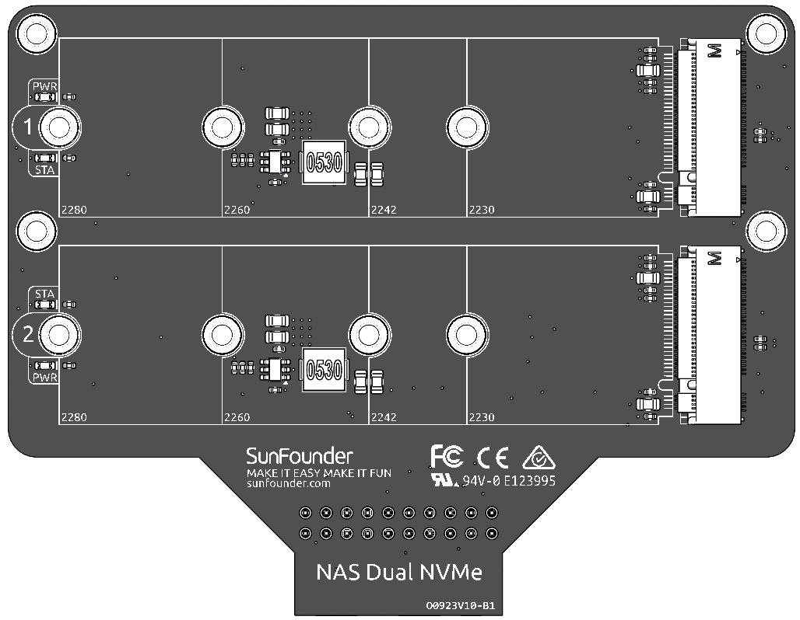

.. note::

    Hello, welcome to the SunFounder Raspberry Pi & Arduino & ESP32 Enthusiasts Community on Facebook! Dive deeper into Raspberry Pi, Arduino, and ESP32 with fellow enthusiasts.

    **Why Join?**

    - **Expert Support**: Solve post-sale issues and technical challenges with help from our community and team.
    - **Learn & Share**: Exchange tips and tutorials to enhance your skills.
    - **Exclusive Previews**: Get early access to new product announcements and sneak peeks.
    - **Special Discounts**: Enjoy exclusive discounts on our newest products.
    - **Festive Promotions and Giveaways**: Take part in giveaways and holiday promotions.

    👉 Ready to explore and create with us? Click [|link_sf_facebook|] and join today!

NAS Dual NVMe Board
===============================================

The **Dual NVMe PIP** (PCIe Peripheral Board), is a PCIe adapter designed specifically for NVMe solid-state drives.

The Raspberry Pi 5’s PCIe interface natively offers a single **Gen2 x1** lane (500 MB/s). By integrating the **ASM1182e** PCIe switch chip, the Dual NVMe PIP expands this into **two independent Gen2 x1 lanes**, allowing you to connect:

* **Two M.2 NVMe SSDs**, or
* **One M.2 NVMe SSD + one M.2 Hailo-8/8L AI accelerator**

**Key Notes**:

* Gen3 is not supported
* Supports NVMe SSD sizes: **2230**, **2242**, **2260**, **2280** (all in M.2 M-key slots)

* The board assemble to NAS HAT with 20 pin header.
* **STA**: A Status LED indicator.
* **PWR**: A Power LED indicator.

About the Model
---------------------------

M.2 SSDs, known for their compact size, come in various types mainly differentiated by their keying (notch design on the connector) and the interface they use. Here are the primary types:

* **M.2 SATA SSDs**: These use the SATA interface, similar to 2.5-inch SATA SSDs but in the smaller M.2 form factor. They are limited by the SATA III maximum speeds of around 600 MB/s. These SSDs are compatible with M.2 slots keyed for B and M keys.
* **M.2 NVMe SSDs**: These SSDs use the NVMe protocol over PCIe lanes and are significantly faster than M.2 SATA SSDs. They are suitable for applications requiring high read/write speeds like gaming, video editing, and data-intensive tasks. These SSDs typically require M-keyed slots. These drives utilize the PCIe (Peripheral Component Interconnect Express) interface, with different versions like 3.0, 4.0, and 5.0. Each new version of PCIe effectively doubles the data transfer speed of its predecessor. However, the Raspberry Pi 5 uses a PCIe 3.0 interface, capable of delivering transfer speeds up to 3,500 MB/s. 

M.2 SSDs come in three key types: B key, M key, and B+M key. However, later on, the B+M key was introduced, combining the functionalities of the B key and M key. As a result, it replaced the standalone B key. Please refer to the image below.

.. image:: img/ssd_key.png

In general, M.2 SATA SSDs are B+M-keyed (can fit in sockets for B-keyed and M-keyed modules), while M.2 NVMe SSDs for PCIe 3.0 x4 lane are M-keyed.

.. image:: img/ssd_model2.png

About the Length
-----------------------

M.2 modules come in different sizes and can also be utilized for Wi-Fi, WWAN, Bluetooth, GPS, and NFC.

Pironman 5 NAS supports four (PCIe Gen 2.0) NVMe M.2 SSD sizes based on their names: 2230, 2242, 2260, and 2280. The "22" is the width in millimeters (mm), and the two following numbers are the length. The longer the drive, the more NAND flash chips can be mounted; therefore, the more capacity.

.. image:: img/m2_ssd_size.png
  :width: 600

