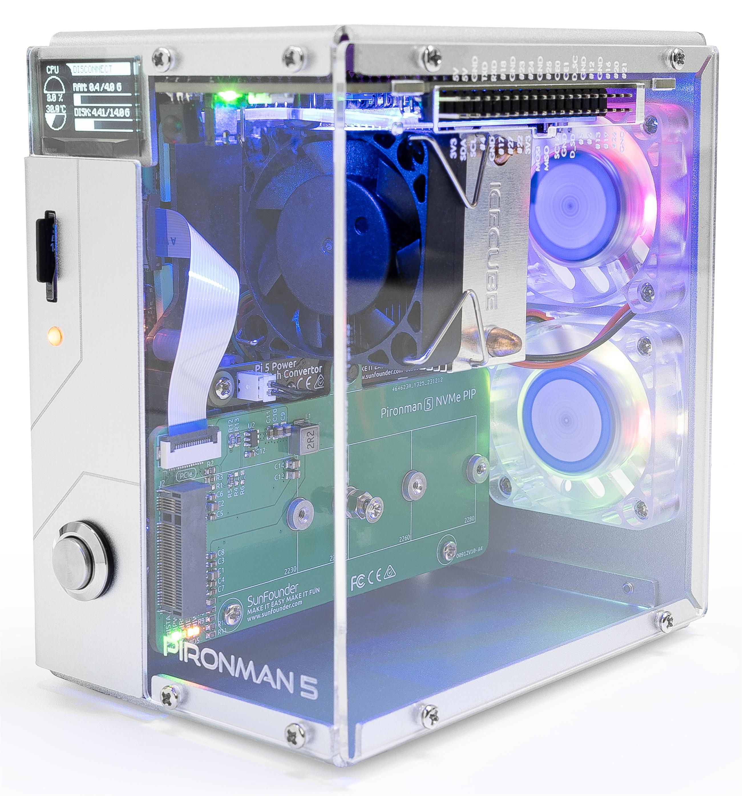

.. note::

    Hello, welcome to the SunFounder Raspberry Pi & Arduino & ESP32 Enthusiasts Community on Facebook! Dive deeper into Raspberry Pi, Arduino, and ESP32 with fellow enthusiasts.

    **Why Join?**

    - **Expert Support**: Solve post-sale issues and technical challenges with help from our community and team.
    - **Learn & Share**: Exchange tips and tutorials to enhance your skills.
    - **Exclusive Previews**: Get early access to new product announcements and sneak peeks.
    - **Special Discounts**: Enjoy exclusive discounts on our newest products.
    - **Festive Promotions and Giveaways**: Take part in giveaways and holiday promotions.

    👉 Ready to explore and create with us? Click [|link_sf_facebook|] and join today!

Pironman 5 NAS
================================================================================

Thanks for choosing our |link_pironman5|.

Pironman 5 NAS是我们Pironman 树莓派机箱系列的新产品。只适配目前最新的树莓派5。NAS Network Attached Storage，是一个本地网络储存盘，可以给你提供私人的，安全的，大量的，不限速的储存空间。当然，除此之外，这个产品还可以用作个人的服务器，实现如多媒体，游戏机，广告过滤器等功能。
Pironman 5 NAS，内置1个2.5G网口+ 1个千兆网口（树莓派原本自带），给你提供更快的网络速度，配备2个3.5寸（兼容2.5寸）机械硬盘的槽位，可以配置软件RAID0或者RAID1. 配备9cm大风扇，可以更安静的给整个设备提供良好的散热性能。配备OLED屏显示树莓派的基本信息，和磁盘信息。把micro HDMI接口转接为更常用的标准HDMI接口，增加正面USB方便快速访问。

The case integrates a PCIe Gen 2 Switch with two M.2 M key PCIe slots supporting 2230, 
2242, 2260, and 2280, allowing the installation of two NVMe Gen2 SSDs or AI accelerators. 
Users can set up two NVMe SSDs in software RAID 0 or RAID 1 for NAS configurations; 
combine one AI accelerator and one NVMe SSD to boost AI performance; 
or use two AI accelerators for even stronger AI capabilities. 
Additionally, GPIO expansion is provided for convenient extension of the Raspberry Pi’s functionality.

.. .. note::

..     This document is available in the following languages.

..     * |link_german_tutorials|
..     * |link_jp_tutorials|
..     * |link_en_tutorials|
..     * |link_fr_tutorials|
..     * |link_es_tutorials|
..     * |link_it_tutorials|
    
..     Please click on the respective links to access the document in your preferred language.

If you have any questions, please send an email to service@sunfounder.com and we will respond as soon as possible.

.. raw:: html

    

.. toctree::
    :maxdepth: 1

    About this Kit <self>
    what_do_we_need    
    assembly_instructions
    install/install_the_os
    omv
    set_up/set_up_pironman5
    control/control_pironman5
    advanced/advanced
    compitable_nvme_ssd
    faq

    

**Parameters**

* Dimension: 108.8 x 108.8 x 216mm
* Material
    * Main body: aluminum alloy
    * Side panel: acrylic
* Support Platform: Raspberry Pi 5
* Power Input: USB Type C, 12V/4A
* Interfaces
    * Raspberry Pi standard 40-Pin GPIO
    * spring-loaded Micro SD socket
    * USB Type C power input
    * 2 x USB 2.0
    * 2 x USB 3.0
    * Gigabit LAN port
    * 2 x 4Kp60 HDMI Type A
* Power button
* OLED screen: 0.96'' 128x64 resolution
* 9025 PWM Fan
* Tower Cooler
* Storage: 3.5-inch SATA (compatible with 2.5-inch) x2, micro SD card x1
* 1220 Battery for RTC

**Copyright Notice**

All contents including but not limited to texts, images, and code in this manual are owned by the SunFounder Company. You should only use it for personal study,investigation, enjoyment, or other non-commercial or nonprofit purposes, under therelated regulations and copyrights laws, without infringing the legal rights of the author and relevant right holders. For any individual or organization that uses these for commercial profit without permission, the Company reserves the right to take legal action.

